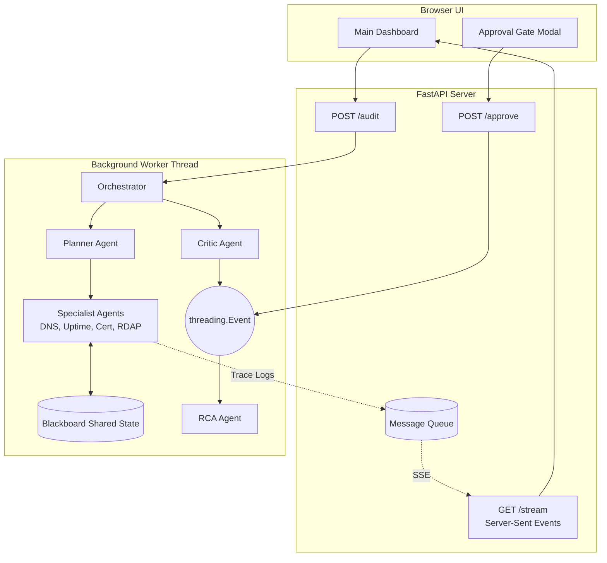

# 🛡️ Domain Guardian

**An Autonomous, Multi-Agent Level 1 Site Reliability Engineer**

Domain Guardian is a production-grade multi-agent system that automates the 3 AM incident triage process. It runs a rigorous, deterministic diagnostic runbook against any domain (checking DNS, TLS, Uptime, and RDAP), gracefully handles network edge cases, and synthesizes the findings into a human-readable Root Cause Analysis (RCA) using Gemini. 

It prepares the diagnosis, formats an actionable Slack payload, and stops at a hard Human-in-the-Loop (HITL) approval gate, ensuring safe and accountable automation.

---

## ✨ Key Features

* **Deterministic Agents, Zero Hallucinations:** Network checks (TLS expiration dates, DNS array parsing, HTTP status codes) are performed by deterministic Python agents. AI is strictly confined to post-mortem synthesis, eliminating the risk of factual hallucinations.
* **Real-World Resilience:** Hardened to survive actual internet edge cases. It bypasses WAF/Bot protections (Cloudflare/Akamai) with realistic User-Agents, gracefully extracts apex domains for RDAP, and automatically handles Internationalized Domain Names (IDN/Punycode).
* **Asynchronous Streaming Architecture:** A `ThreadPoolExecutor` handles blocking network calls while a `queue.Queue` pipes live trace events to a FastAPI Server-Sent Events (SSE) endpoint, providing a real-time, non-blocking UI.
* **Human-in-the-Loop (HITL) Gate:** The system never mutates state or sends alerts without human consent. A dedicated Critic agent pauses the execution thread (`threading.Event`) to await manual web UI approval.
* **LLM-Powered Synthesis:** Once the deterministic runbook completes, a synthesis agent uses **Google Gemini** (`google-genai`) to generate a professional incident report and a ready-to-deploy Slack Block Kit payload.

---

## 🏗️ Architecture

Domain Guardian utilizes a **Blackboard Pattern** for shared state and a multi-threaded web bridge for real-time observability.



---

## 🚀 Getting Started

### Prerequisites

* Python 3.9+
* A Google Gemini API Key

### Installation

1. **Clone the repository:**
```bash
git clone [https://github.com/yourusername/domain-guardian.git](https://github.com/yourusername/domain-guardian.git)
cd domain-guardian

```


2. **Install dependencies:**
```bash
pip install fastapi uvicorn requests google-genai python-dotenv

```


3. **Configure Environment:**
Create a `.env` file in the root directory and add your Gemini API key:
```env
GEMINI_API_KEY=your_gemini_api_key_here

```


4. **Run the Server:**
```bash
uvicorn app:app --host 127.0.0.1 --port 8000 --reload

```


5. **Access the Dashboard:**
Open your browser and navigate to [http://127.0.0.1:8000](http://127.0.0.1:8000?utm_source=gemini)

---

## 🖥️ User Interface

The frontend is a single-file, zero-build dashboard built with Tailwind CSS and Vanilla JavaScript.

* **Live Trace Table:** Watch the Planner delegate tasks to Specialist agents in real-time.
* **Blackboard Viewer:** Inspect the live JSON state as agents read and mutate shared memory.
* **Incident Report Card:** View the AI-synthesized RCA and one-click copy the Slack Block Kit payload.
* **Chaos Mode:** Simulate network failures (e.g., DNS Timeout, Expired Cert) directly from the UI to test agent recovery logic.

---

## 🛠️ Extensibility (What's Next)

The modular Blackboard architecture makes it trivial to add new capabilities:

* **Remediation Agents:** Add a "DNS Mutator" agent capable of failing over A-records via the Cloudflare API once the Uptime agent detects a 502 error.
* **Temporal Memory:** Connect a SQLite historian agent to track domain degradation (e.g., latency spikes) over 30-day periods.
* **Distributed Checks:** Implement a Fleet Commander agent to spin up ephemeral AWS Lambdas for multi-region uptime verification.

---

*Built as a resilient, multi-agent solution for the modern SRE stack.*

```

```   